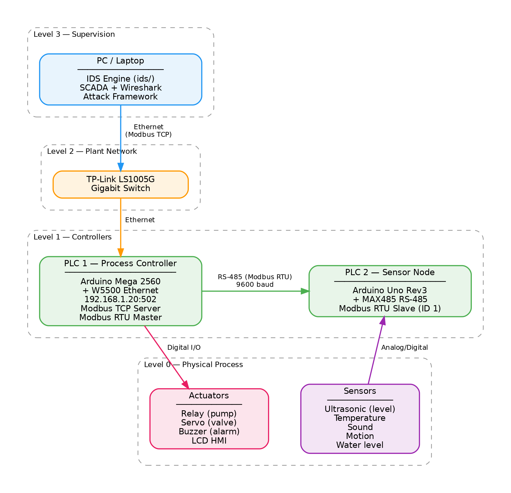

# CPS-IDS

AI/ML-driven Intrusion Detection System for Cyber-Physical Systems.

## What This Is

A complete IDS/IPS prototype targeting industrial control systems, consisting of:

1. **`ids/`** — ML detection engine trained on three public intrusion datasets (NSL-KDD, CIC-IDS2017, UNSW-NB15) with a unified 5-class label scheme (Normal, DoS, Probe, R2L, U2R)
2. **`plant/`** — Physical CPS testbed: Arduino-based water treatment plant with Modbus RTU/TCP, attack tools, and a software simulation

## Architecture



## Detection Models

Detection uses three complementary models:
- **Random Forest** (smartcore) — supervised, handles known attack patterns
- **Isolation Forest** — unsupervised anomaly detection for zero-days
- **CNN+LSTM** (PyTorch) — deep learning, Conv1d→LSTM→FC, ~297K params (implemented, not yet trained)

### Training Results (Random Forest + Isolation Forest)

| Model | Dataset | Features | Random Forest | Isolation Forest | RF + IForest | FPR |
|-------|---------|----------|---------------|------------------|--------------|-----|
| A | NSL-KDD (1999) | 122 | 67.26%\* | 77.24% | 67.26%\* | 0.0301 |
| B | CIC-IDS2017 (2017) | 78 | **99.73%** | 81.37% | **99.73%** | **0.0006** |
| C | UNSW-NB15 (2015) | 76 | 93.90% | 82.50% | 93.84% | 0.0251 |
| D | Combined (A+B+C) | 276 | 97.80% | 80.20% | **97.82%** | 0.0043 |

\*Model A metrics limited by NSL-KDD binary-only test labels (Probe/R2L/U2R collapsed)

Key findings:
- **Model B** achieves 99.73% with 0.06% FPR — best single-dataset result
- **Model D** demonstrates cross-era generalisation at 97.80% across 276 zero-padded features
- **RF + IForest ensemble improves minority class detection** (Model D R2L recall: 0.75 → 0.82)
- **U2R remains hardest** — extremely rare class across all datasets

## Quick Start

### IDS Training

```bash
# Setup (installs Rust toolchain + system deps)
cd ids/scripts && ./setup.sh

# Python PyTorch training (AMD ROCm or NVIDIA CUDA)
cd ids/pytorch-train && ./setup.sh && source env.sh
python train.py --dataset cicids2017 \
    --cicids-dir ../../CIC-IDS2017-Dataset/CSVs/MachineLearningCSV/MachineLearningCVE/ \
    --output-dir data/models/model-b --no-smote

# Run all 4 models sequentially
./train_all.sh

# Rust parallel training (CPU, 16+ cores)
cd ids/parallel-train && ./setup.sh

# Run workspace tests
cd ids && cargo test --workspace
```

### Plant Simulation

```bash
cd plant/simulation
pip install -r requirements.txt

# Full Mininet simulation (needs root)
sudo python3 run.py

# Local mode (no network isolation)
python3 run.py --no-mininet
```

### Attack Tools

```bash
pip install pymodbus

# Interactive attack menu targeting PLC 1
python plant/attack.py

# Stuxnet-style rootkit proxy
python plant/stux/rootkit-proxy.py
```

## Project Structure

```
├── ids/                        # IDS/IPS engine
│   ├── crates/                 # Rust workspace (6 crates)
│   │   ├── ids-common/         #   shared types, protocols
│   │   ├── ids-collector/      #   packet capture, host monitoring
│   │   ├── ids-preprocess/     #   dataset loaders, SMOTE, scaling
│   │   ├── ids-engine/         #   RF, IForest, ensemble, training
│   │   ├── ids-response/       #   alerting, SIEM export, blocking
│   │   └── ids-dashboard/      #   web UI (axum)
│   ├── parallel-train/         # Rayon multi-core trainer
│   ├── cnn-lstm-train/         # tch-rs/libtorch GPU trainer
│   ├── pytorch-train/          # Python PyTorch trainer (ROCm/CUDA)
│   └── scripts/                # Setup scripts
├── plant/                      # CPS testbed
│   ├── arduino-plc-firmware.cpp    # PLC 1 (Mega) firmware
│   ├── arduino-uno-sensor-node.cpp # PLC 2 (Uno) firmware
│   ├── attack-framework.py     # Modbus TCP attack library
│   ├── attack.py               # Attack CLI
│   ├── stux/                   # Stuxnet-style rootkit
│   └── simulation/             # MiniCPS + Mininet software twin
├── writeup/                    # Assignment report
└── resources/                  # Planning docs, training logs
```

## Datasets

Download and place at repo root (gitignored):

```
NSL-KDD-Dataset/KDDTrain+.txt, KDDTest+.txt
CIC-IDS2017-Dataset/CSVs/MachineLearningCSV/MachineLearningCVE/*.csv
CIC-UNSW-NB15-Dataset/Data.csv, Label.csv
```

## Hardware

- Arduino Mega 2560 (ELEGOO kit) — PLC 1
- Arduino Uno Rev3 — PLC 2
- W5500 Ethernet module — Modbus TCP
- MAX485 RS-485 converter — Modbus RTU fieldbus
- TP-Link LS1005G switch — plant network
- ELEGOO kit sensors/actuators (ultrasonic, temp, motion, sound, water level, relay, servo, buzzer, LCD, RFID)
